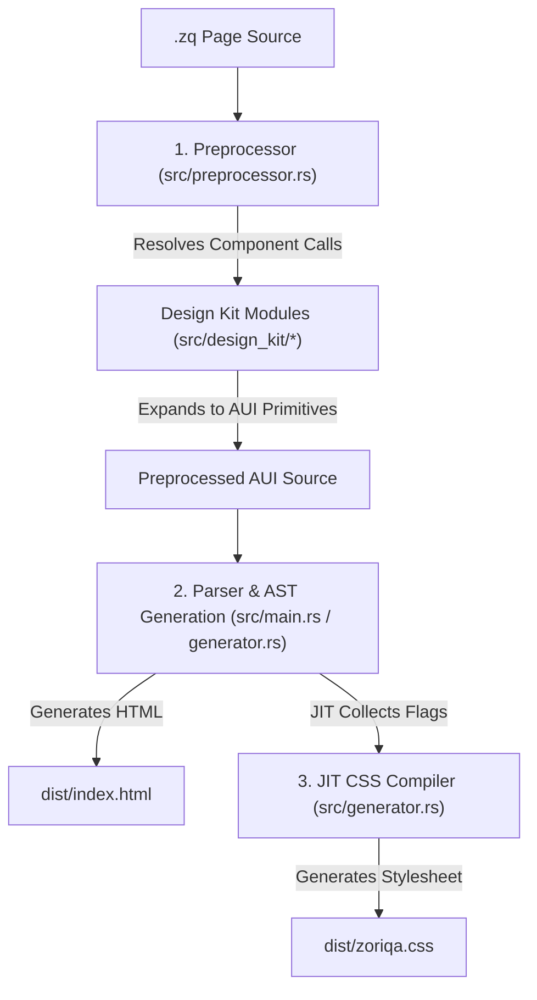

# Zoriqa Design Kit Compiler Architecture Documentation

> [!WARNING]
> **Deprecated**: This document describes the old preprocessor-based Zoriqa architecture. The current compiler uses an AST-driven architecture. Refer to the [master_documentation.md](file:///home/sachin/auig%20my%20project/auig_v0_1/docs/master_documentation.md) for the source of truth.

This documentation describes how the Zoriqa Design Kit is stored, structured, parsed, and compiled end-to-end within the compiler backend.

---

## 1. Overview & Compiler Pipeline

The Zoriqa Design Kit allows users to write pre-designed components like `navbar`, `footer`, `hero`, `alert`, and various `cards` using high-level syntax.

The compiler processes these components in a **three-step pipeline**:



---

## 2. Codebase Storage & File Responsibilities

All backend design kit code is stored in the `src/` directory:

| File Path | Description / Responsibility |
| :--- | :--- |
| [src/preprocessor.rs](file:///home/sachin/auig%20my%20project/auig_v0_1/src/preprocessor.rs) | Intercepts shorthand tags, validates imports, collects indentation blocks, and invokes module expansions. |
| [src/design_kit/mod.rs](file:///home/sachin/auig%20my%20project/auig_v0_1/src/design_kit/mod.rs) | Defines module exports and unit tests verifying component expansion output. |
| [src/design_kit/args.rs](file:///home/sachin/auig%20my%20project/auig_v0_1/src/design_kit/args.rs) | Defines tokenizer, UI call parser, and data structs storing positional arguments, properties, flags, children, and style overrides. |
| [src/design_kit/styles.rs](file:///home/sachin/auig%20my%20project/auig_v0_1/src/design_kit/styles.rs) | Resolves theme tones (`primary`, `success`, etc.) and overrides into physical CSS colors, borders, margins, and shadows. |
| [src/design_kit/nav.rs](file:///home/sachin/auig%20my%20project/auig_v0_1/src/design_kit/nav.rs) | Expands the `navbar` component. |
| [src/design_kit/footer.rs](file:///home/sachin/auig%20my%20project/auig_v0_1/src/design_kit/footer.rs) | Expands the `footer` component (full-width wrapper with nested grid). |
| [src/design_kit/hero.rs](file:///home/sachin/auig%20my%20project/auig_v0_1/src/design_kit/hero.rs) | Expands the `hero` header component. |
| [src/design_kit/feedback.rs](file:///home/sachin/auig%20my%20project/auig_v0_1/src/design_kit/feedback.rs) | Expands `alert` and `badge` components. |
| [src/design_kit/cards.rs](file:///home/sachin/auig%20my%20project/auig_v0_1/src/design_kit/cards.rs) | Expands `stat-card` and `feature-card` components. |
| [src/design_kit/pricing.rs](file:///home/sachin/auig%20my%20project/auig_v0_1/src/design_kit/pricing.rs) | Expands `pricing-card` components with support for popular markers and list checkmarks. |

---

## 3. Core Structures and UI Call Parser

### Data Models (`src/design_kit/args.rs`)
The parsing output of any high-level design kit component is mapped to `UiCall`:

```rust
pub struct UiCall {
    pub name: String,               // Component name (e.g., "navbar", "footer")
    pub positional: Vec<String>,     // Positional string literals (e.g., copyright string, title)
    pub props: HashMap<String, String>, // Named properties (e.g., to "/docs", icon zap)
    pub flags: Vec<String>,         // Design modifier flags (e.g., "dark", "sticky", "popular")
    pub children: Vec<String>,      // Nested block lines
    pub style: StyleOverrides,      // Style block overrides
}

pub struct StyleOverrides {
    pub bg: Option<String>,         // bg override (e.g., "gray-900")
    pub text: Option<String>,       // text override (e.g., "white")
    pub border: Option<String>,     // border override (e.g., "gray-800")
    pub radius: Option<String>,     // radius override (e.g., "xl")
    pub shadow: Option<String>,     // shadow override (e.g., "md")
    pub custom: HashMap<String, String>,
}
```

### Parser Entry Point
- **Function**: `parse_ui_call(header_line: &str, block_lines: &[String]) -> Result<UiCall, String>`
- **Behavior**:
  - Tokens are parsed using whitespace/quote boundaries.
  - String literals (e.g., `"Zoriqa"`) are collected as positional args.
  - Bare keywords followed by string literals (e.g., `to "/pricing"`) are mapped to property key-value pairs.
  - Bare keywords on their own (e.g., `dark`) are registered as flags.
  - A nested block named `style:` is intercepted to populate the `StyleOverrides` struct. All other nested lines are collected as general component `children`.

---

## 4. Style & Tone Resolution

The design system resolves presets into colors, borders, shadows, and spacing.

- **Function**: `resolve_design(tone, defaults, style, props) -> ResolvedStyles`
- **Location**: [src/design_kit/styles.rs](file:///home/sachin/auig%20my%20project/auig_v0_1/src/design_kit/styles.rs)

### Resolution Precedence Hierarchy
When styling variables are calculated, they are resolved in this order (highest priority wins):
1. **Style Override Block** (e.g., `style: bg red-50 text red-800`) — *Highest Priority*.
2. **Inline Properties** (e.g., `bg "green-50"`) — *Fallback*.
3. **Tone Preset Flags** (e.g., `success`, `warning`, `primary`, `dark`, `light`) — *Base design theme color resolved dynamically*.
4. **Default Preset Parameters** — *Global fallback values defined per component*.

### Tone Presets Mapping
Tones map to the following Tailwind-equivalent colors:

| Tone Preset | Background (`bg`) | Text Color (`text`) | Border Color (`border`) |
| :--- | :--- | :--- | :--- |
| `primary` | `blue-600` | `white` | `blue-700` |
| `success` | `green-50` | `green-900` | `green-200` |
| `warning` | `yellow-50` | `yellow-800` | `yellow-200` |
| `danger` / `error` | `red-50` | `red-800` | `red-200` |
| `info` | `blue-50` | `blue-800` | `blue-200` |
| `dark` | `gray-950` | `white` | `gray-800` |
| `light` / `neutral` | `gray-50` | `gray-800` | `gray-200` |

---

## 5. Component Reference Details

Here is the exact mapping of all 8 built-in UI components.

### 1. Navbar (`navbar`)
* **File**: [src/design_kit/nav.rs](file:///home/sachin/auig%20my%20project/auig_v0_1/src/design_kit/nav.rs)
* **Function**: `pub fn expand_navbar(call: &UiCall, indent: &str) -> Result<String, String>`
* **Parameters**: Positional `brand` text, tone flags (`dark` / `light`), configuration flags (`sticky` / `shadow`), links and actions nested inside the block.
* **Expanded Code**: Generates a header `row` element styled with background, layout, and fixed positioning helper classes, containing nested logo/nav/button rows.

### 2. Footer (`footer`)
* **File**: [src/design_kit/footer.rs](file:///home/sachin/auig%20my%20project/auig_v0_1/src/design_kit/footer.rs)
* **Function**: `pub fn expand_footer(call: &UiCall, indent: &str) -> Result<String, String>`
* **Parameters**: Positional `copyright` text, tone flags (`dark` / `light`), columns of links nested inside the block.
* **Expanded Code**:
  Generates a full-width `box` wrapper and a centered inner `section`:
  ```aui
  box bg-gray-950 text-white border-t border-gray-800 w-full:
    section py-12 px-8:
      (nested children)
      row justify-between items-center border-t border-gray-800 pt-8 mt-8:
        p "© 2026 Zoriqa Project" muted small
  ```

### 3. Hero Section (`hero`)
* **File**: [src/design_kit/hero.rs](file:///home/sachin/auig%20my%20project/auig_v0_1/src/design_kit/hero.rs)
* **Function**: `pub fn expand_hero(call: &UiCall, indent: &str) -> Result<String, String>`
* **Parameters**: Positional `title`, tone flags (`primary`, `success`), subtitle, and action buttons nested as children.
* **Expanded Code**: Generates a centered `section` with padding (`py-20 px-8`), text size (`h1` bold large), and action buttons.

### 4. Stat Card (`stat-card`)
* **File**: [src/design_kit/cards.rs](file:///home/sachin/auig%20my%20project/auig_v0_1/src/design_kit/cards.rs)
* **Function**: `pub fn expand_stat_card_new(call: &UiCall, indent: &str) -> Result<String, String>`
* **Parameters**: Positional `title` and `value`, tone preset flags, and custom style blocks.
* **Expanded Code**: Generates a `card` element with title (muted small text) and value (bold header).

### 5. Feature Card (`feature-card`)
* **File**: [src/design_kit/cards.rs](file:///home/sachin/auig%20my project/auig_v0_1/src/design_kit/cards.rs)
* **Function**: `pub fn expand_feature_card(call: &UiCall, indent: &str) -> Result<String, String>`
* **Parameters**: Positional `title`, nested `icon` and `desc` components, and tone preset flags.
* **Expanded Code**: Generates a `card` wrapping a vertical `column` with an icon badge (circle/square block), title, and description.

### 6. Pricing Card (`pricing-card`)
* **File**: [src/design_kit/pricing.rs](file:///home/sachin/auig%20my%20project/auig_v0_1/src/design_kit/pricing.rs)
* **Function**: `pub fn expand_pricing_card(call: &UiCall, indent: &str) -> Result<String, String>`
* **Parameters**: Positional `tier_name` and `price`, `popular` flag (adds scale transform and border outline highlight), `desc`, `item` checkmark features, and pricing buttons.
* **Expanded Code**: Generates a card container containing vertical details, a checkmark item grid, and a call-to-action button.

### 7. Alert (`alert`)
* **File**: [src/design_kit/feedback.rs](file:///home/sachin/auig%20my%20project/auig_v0_1/src/design_kit/feedback.rs)
* **Function**: `pub fn expand_alert(call: &UiCall, indent: &str) -> Result<String, String>`
* **Parameters**: Positional `title`, tone preset flags (`success`, `danger`, `warning`), and `message` text.
* **Expanded Code**: Generates a colored, rounded horizontal banner `row` containing an title and description body.

### 8. Badge (`badge`)
* **File**: [src/design_kit/feedback.rs](file:///home/sachin/auig%20my%20project/auig_v0_1/src/design_kit/feedback.rs)
* **Function**: `pub fn expand_badge(call: &UiCall, indent: &str) -> Result<String, String>`
* **Parameters**: Positional badge label and tone flags.
* **Expanded Code**: Generates a small inline rounded pill `row` with centered text.

---

## 6. End-to-End Walkthrough Example

Here is a step-by-step example showing how a page footer is processed.

### 1. Input code in `pages/index.zq`
```aui
import "zoriqa/ui"

page Home:
  view:
    footer "© 2026 Zoriqa Project." dark:
      row gap-large:
        column:
          h2 "Zoriqa" bold text-white
```

### 2. Preprocessor Interception
In `src/preprocessor.rs`, the line starting with `footer ` is matched. The block lines are collected:
```text
      row gap-large:
        column:
          h2 "Zoriqa" bold text-white
```
`parse_ui_call` is called, returning a `UiCall` struct containing:
- `name`: `"footer"`
- `positional`: `["© 2026 Zoriqa Project."]`
- `flags`: `["dark"]`
- `children`: `["      row gap-large:", "        column:", "          h2 \"Zoriqa\" bold text-white"]`

### 3. Macro Expansion
`expand_footer` is called and returns the expanded AUI code:
```aui
    box bg-gray-950 text-white border-t border-gray-800 w-full:
      section py-12 px-8:
        row gap-large:
          column:
            h2 "Zoriqa" bold text-white
        row justify-between items-center border-t border-gray-800 pt-8 mt-8:
          p "© 2026 Zoriqa Project." muted small
```

### 4. HTML Class Generation
The compiler parses the expanded AUI structure and translates it to HTML elements. Each class name gets prefixed with `zq-`:
```html
<div class="zq-box zq-bg-gray-950 zq-text-white zq-border-t zq-border-gray-800 zq-w-full">
  <div class="zq-section zq-py-12 zq-px-8">
    <div class="zq-row zq-gap-large">
      <div class="zq-column">
        <h2 class="zq-heading zq-h2 zq-bold zq-text-white">Zoriqa</h2>
      </div>
    </div>
    <div class="zq-row zq-justify-between zq-items-center zq-border-t zq-border-gray-800 zq-pt-8 zq-mt-8">
      <p class="zq-text zq-muted zq-small">© 2026 Zoriqa Project.</p>
    </div>
  </div>
</div>
```

### 5. JIT CSS Generation
The flags/classes generated in the HTML (like `bg-gray-950`, `w-full`, `py-12`, `border-t`) are collected into a set. The CSS generator in `src/generator.rs` matches them and compiles the minimized `dist/zoriqa.css`:
```css
.zq-bg-gray-950 { background-color: #030712; }
.zq-w-full { width: 100%; }
.zq-py-12 { padding-top: 48px; padding-bottom: 48px; }
.zq-border-t { border-top-style: solid; border-top-width: 1px; }
```
This output is written directly to the target output CSS file.
